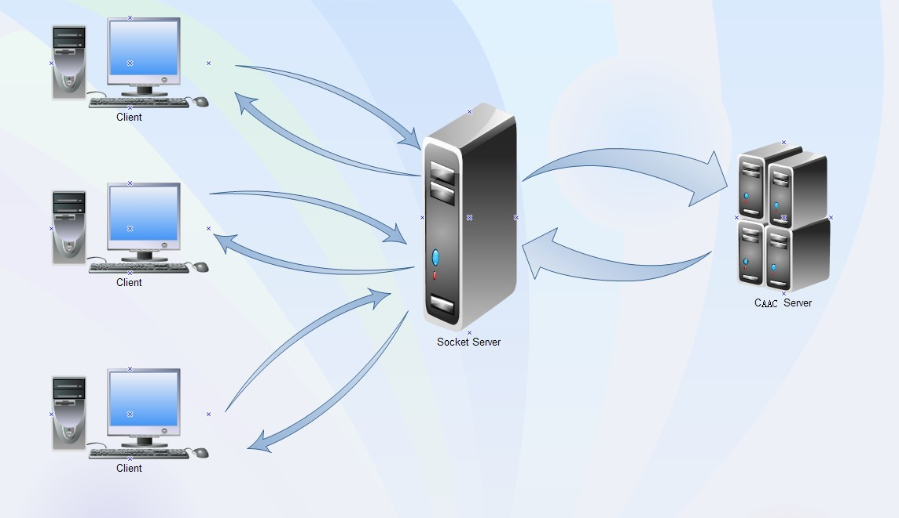
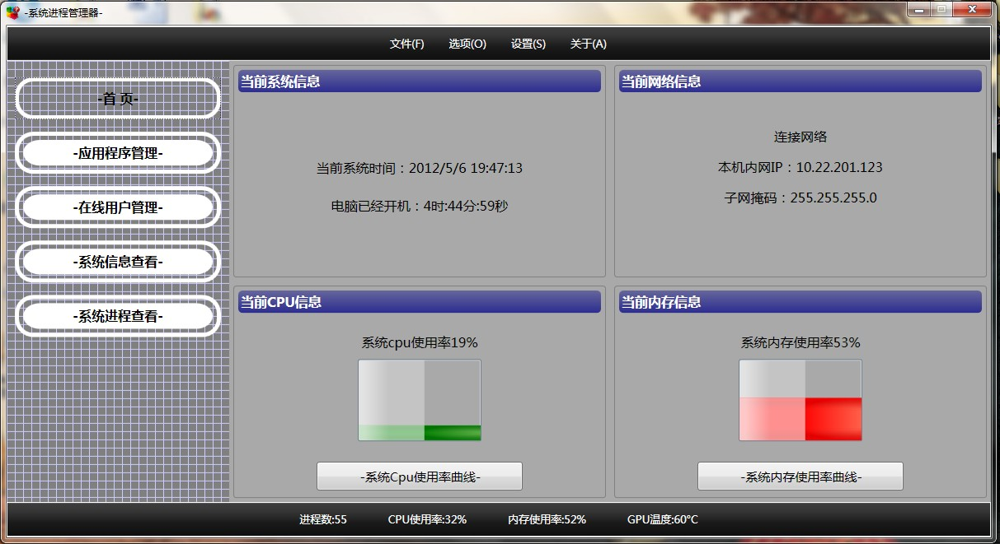
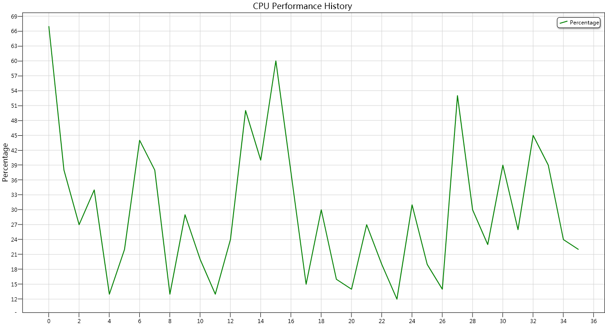
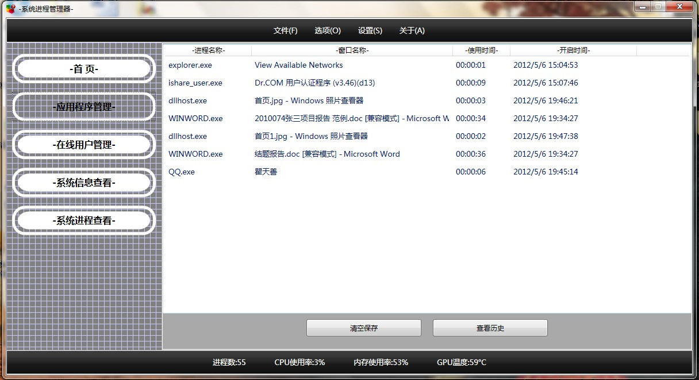
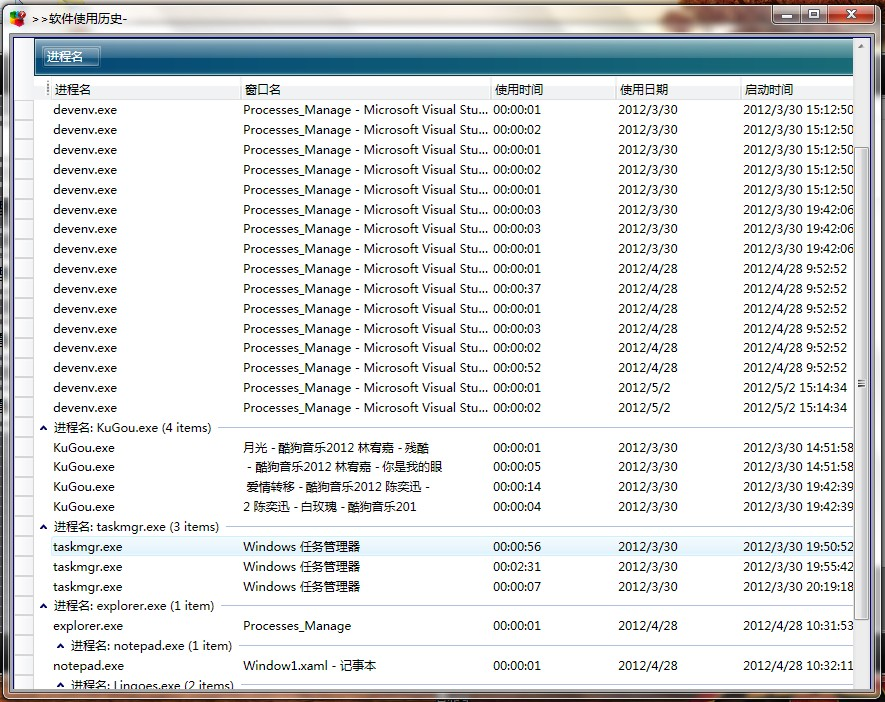
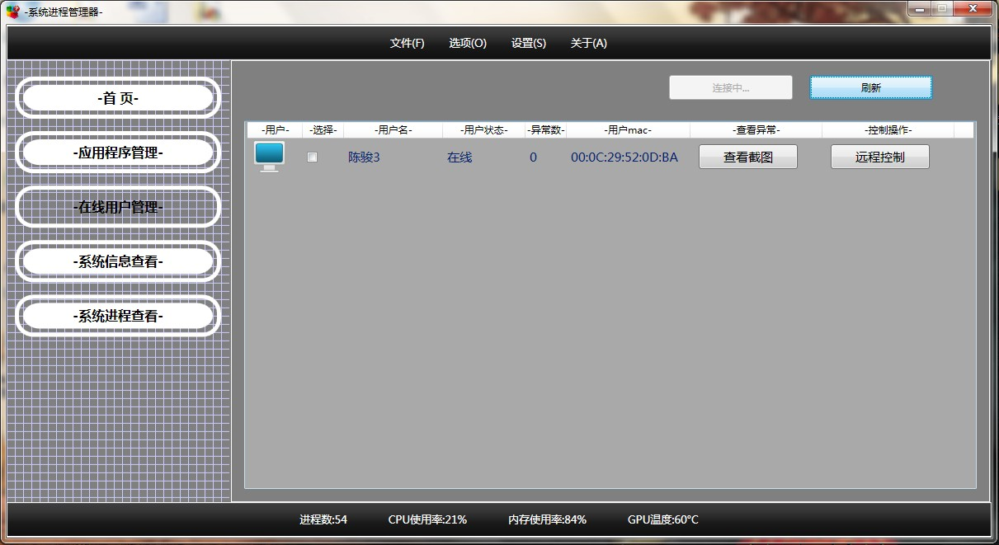
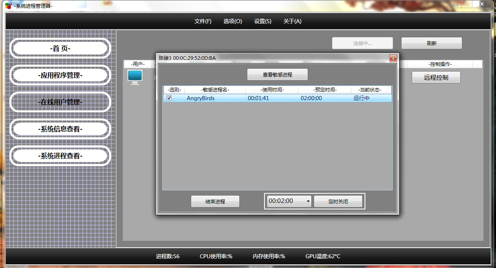
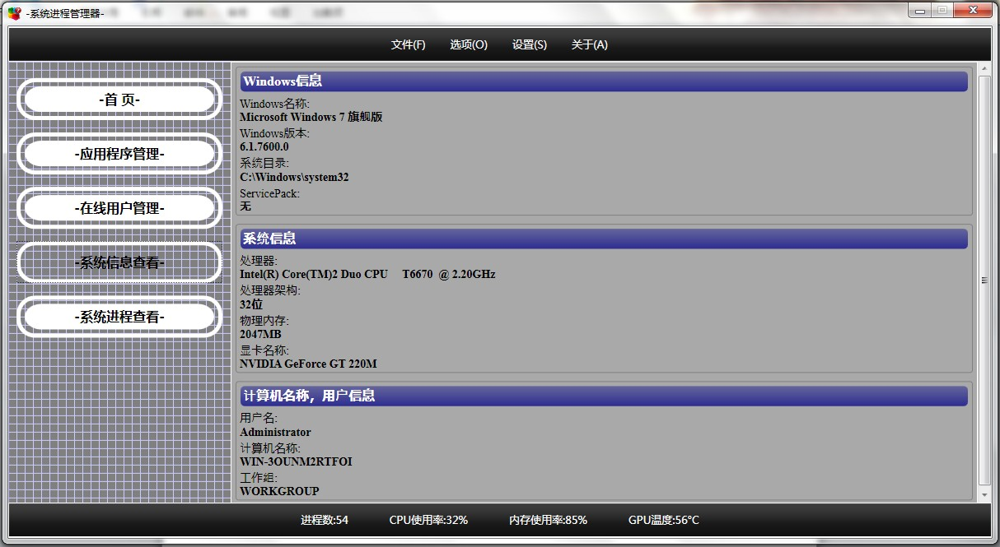
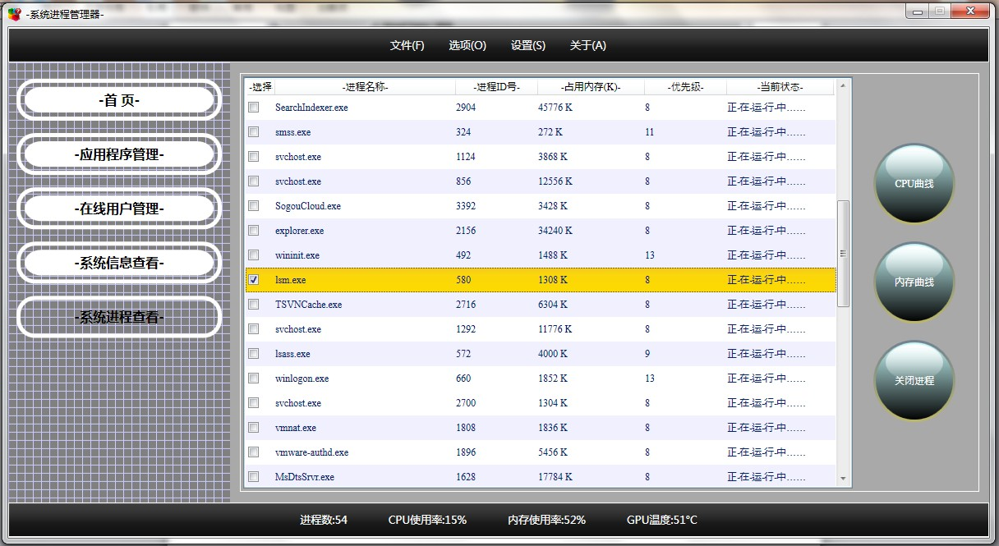

# ProcessManage

一个可用于防沉迷的软件

## 背景

现如今，计算机使用相当普及，PC机上的游戏软件数不胜数，给我们的生活带来无尽的乐趣。适量游戏可以放松我们的心情，但是过度游戏严重损伤了我们的健康。生活中常常有这样的情景，如：对某个家庭来说，家长想控制自己的小孩（特别是对有网瘾的青少年）上网游戏时间，但是不能有充足的时间去实时有效地管理他们；对某个企业来说，领导想监控员工的工作情况，进而阻止他们在工作时玩一些休闲类游戏，但是实际中很难做到有效监控。这些实际场景对游戏软件管理提出了需求，而现实中大多数的管理软件，只涉及到了很基本的一些功能（如：手动关闭某个程序进程，查看一些进程信息等等），而且这些功能大多数比较机械，不能灵活地管理好软件的使用。因此，有必要实现一个智能、安全隐蔽、可远程监控的进程管理软件。

## 成果

软件最终实现的是一个基于C/S架构的进程管理系统，整个系统主要分为三部分：

* **普通用户：**隐藏的Windows服务，用于监控及管理用户进程使用。隐藏的服务利用进程行为分析法在后台监控用户使用的程序，如果分析结果为游戏进程，则记录此进程(在默认设置时间内自动关闭)并且发送屏幕截图给服务器

* **超级用户：**a.管理所有普通用户(一个局域网内)，如果发现某个用户有异常情况，则查看用户的屏幕截图或者远程关闭(可定时)用户进程。b.对本机的一些常用操作，如查看系统信息，软件使用管理等

* **服务器：**后台运行的Windows服务，用于转发超级用户和普通用户的消息，用户群信息的管理，存储普通用户发来的屏幕截图等信息

## 效果

**管理员操作界面**

**首页**

**应用程序管理**

**在线用户管理**

**系统信息查看**

**系统进程查看**

## 安装配置

**普通用户执行环境配置**

1. 服务执行文件在ProcessesManageService文件夹下，文件夹里面主要由服务执行文件ProcessesManageService.exe及服务配置文件等。

2. 服务运行系统环境要求：安装.Net Framework 3.5框架，Windows Xp系统

3. 服务的替换：选择系统中一个不用的第三方服务，查看其服务名称。利用SC命令替换器执行路径，如：系统中有一个不用的第三方服务名称为：Test，自己的服务完整路径为：`C:\Debug\ProcessesManageService.exe`，则完整的替换命令为：
`sc config Test binpath= “C:\Debug\ProcessesManageService.exe”`

4. 替换后设置：将服务启动方式设置为“自动”，选择“允许与桌面交互”

5. 完成上述步骤，可以启动服务

**服务器配置**

1. 执行环境Windows Server 2008，.Net Framework3.5框架，Access数据库的安装

2. 服务执行文件在ServerManageService文件夹下，里面有服务安装的工具：InstallUtil.exe和服务执行文件ServerManageService.exe及其他服务配置文件

3. 服务安装：利用cd命令，将当前执行目录导到服务执行文件的目录下。然后执行InstallUtil ServerManageService.exe安装服务

4. 启动该服务

**超级用户端环境配置**

1. 执行环境：Windows Xp/7，.Net Framework3.5框架

2. 执行文件在Processes_Manage的bin目录下，双击.exe文件即可

3. 修改**.exe.config中`<add key="Path" value=”…”/>`网络图片途径
